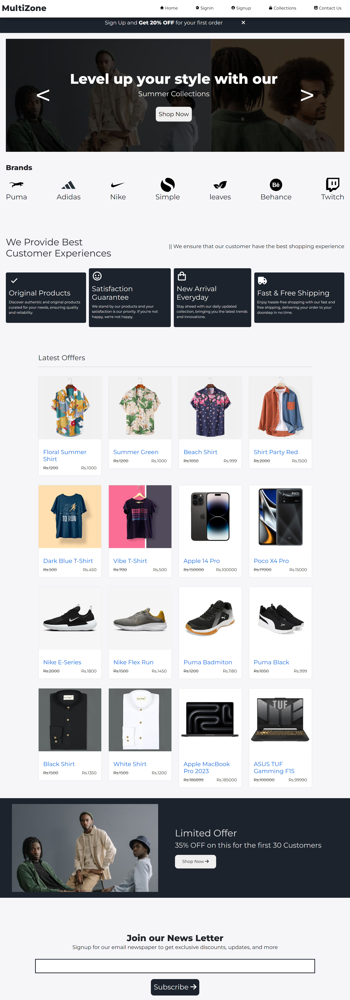

# Python Full Stack 

# Project Details
- PROJECT TITLE      : Retail E-commerce

## 🚀 How to Run

# Step 1: Navigate to the project directory
cd ecommerce

# Step 2: Apply migrations
python manage.py migrate

# Step 3: Run the development server
python manage.py runserver

# 📘 Project Description

Retail E-Commerce is a full-stack e-commerce web application built using Python Django.
It provides a complete shopping experience for users and a management interface for administrators.

The application allows users to browse products, add them to the cart, and place secure orders.
The admin panel enables efficient management of products, orders, and overall site operations. 

# Technologies Used
1. Python Django
2. HTML
3. CSS
4. JavaScript
5. MySQL

## 🎯 Key Features

### 👤 User Features
- User registration and login  
- Browse and view product details  
- Add items to cart and manage quantity  
- Checkout and order placement  
- View order history and current status  

### 🧑‍💼 Admin Features
- Secure admin login  
- Manage products (Create, Read, Update, Delete)  
- Manage orders (View, Filter, Update Status)  
- Dashboard with summary information  

# Output

# 🏁 Conclusion
The MultiZone Retail E-Commerce project demonstrates the integration of Python Django, frontend technologies, and database management to build a fully functional e-commerce platform.
It showcases essential full-stack development skills — from user authentication and cart management to secure admin operations.
